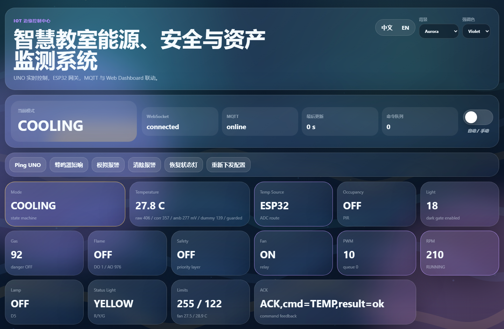
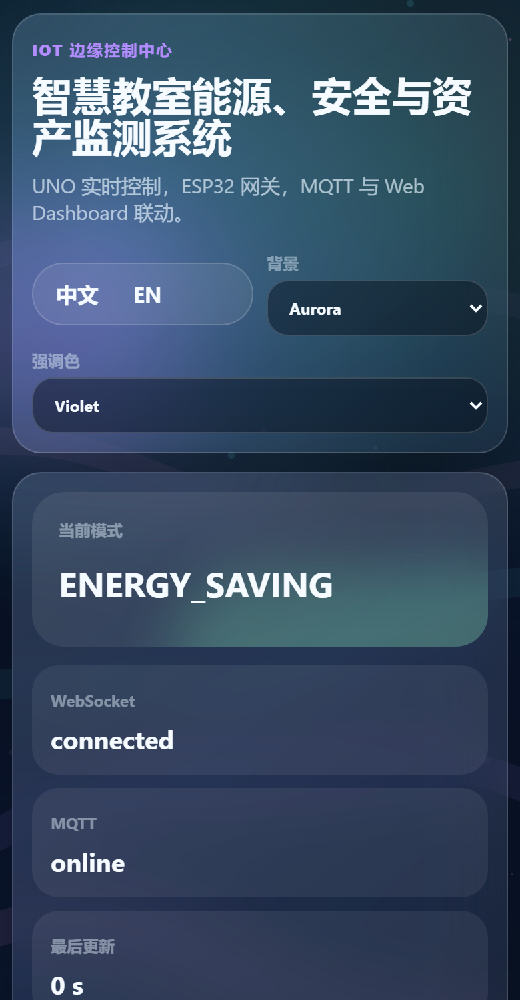

# Smart Classroom Energy-Saving, Safety & Asset Monitoring System

**IOT104TC Coursework 2 Group Work Lab Demonstration Report**

**GitHub repository:** https://github.com/3351666087/desktop-tutorial

## Team

| Student | Student ID | Main demonstration responsibility |
|---|---:|---|
| Rui Huang | 2471007 | System integration, AI/voice/MQTT control loop, final technical demo |
| Jingzhe Zhang | 2472494 | Arduino edge control, sensors, actuators and safety layer explanation |
| Tianyu Bai | 2471763 | ESP32 gateway, UART/MQTT networking and operations explanation |
| Chenyun Xu | 2470797 | Dashboard, mobile interaction, documentation and use-case explanation |

## Executive Summary

This project implements a complete local-first IoT classroom service using Arduino UNO, ESP32 and a laptop service layer. The Arduino UNO is the edge control node. It reads occupancy, light, temperature, gas, flame and emergency-button inputs, then controls the classroom lamp, buzzer, traffic-light indicator, relay-powered 12 V fan, fan PWM and tachometer feedback. The ESP32 is the IoT gateway. It receives UNO telemetry over UART, publishes MQTT messages over Wi-Fi, and forwards dashboard commands back to the UNO. The laptop provides the MQTT broker, a responsive web dashboard, data analytics, a persistent AI backend, mobile HTTPS microphone input and Qwen-based structured command planning.

The key achievement is not only monitoring. The system demonstrates a closed IoT control loop:

```text
Physical sensors -> Arduino edge control -> ESP32 MQTT gateway -> Web dashboard
-> mobile voice input -> faster-whisper ASR -> Qwen structured task planning
-> MQTT command -> ESP32 UART bridge -> Arduino actuator control -> physical change
```

During the final demonstration, a mobile voice command such as "switch to manual mode and set the fan to maximum speed" was converted into a structured device task and executed on the physical fan through MQTT and UART. This shows a real IoT application/service rather than a simple sensor-display prototype.

## Real-Life Problem And Use Case

Classrooms often waste energy when lights or ventilation stay on after people leave. Safety risks such as gas leakage, flame detection or emergency incidents must also override normal energy-saving behavior immediately. A practical classroom monitoring system should therefore be able to:

- reduce unnecessary lighting and ventilation,
- respond locally to safety events without depending on cloud connectivity,
- provide facility operators with live telemetry and remote configuration,
- make control easy for non-technical users through a dashboard or voice interface,
- retain enough data to support operations and comfort optimization.

Our project targets a smart classroom deployment scenario where the system can be installed as a low-cost retrofit service for teaching rooms, labs or maker spaces.

## Layered IoT Architecture



The system is deliberately separated into layers so that each part has a clear operational responsibility.

| Layer | Implementation | Responsibility |
|---|---|---|
| Physical layer | PIR, TEMT6000, LM35, gas sensor, flame sensor, button, LED, buzzer, relay, fan, traffic light | Sense classroom state and perform physical actions |
| Edge control layer | Arduino UNO R3 | Real-time state machine, safety priority, actuator control, UART telemetry and ACK |
| Gateway layer | ESP32 | Wi-Fi, MQTT publish/subscribe, UART bridge, ESP32 ADC route for temperature |
| Service layer | Laptop Node.js service | MQTT broker, web dashboard, WebSocket updates, command queue, settings persistence |
| Intelligence layer | persistent Python AI backend + Qwen | ASR, CUDA preference recommendation, natural-language to structured timeline tasks |
| User layer | Desktop/mobile browser | Monitoring, manual control, presets, voice input, charts and logs |

This architecture directly supports Learning Outcome E: it demonstrates a layered IoT system with edge, gateway, service and application layers.

## Hardware Components

The hardware combines the provided Arduino lab modules with additional practical components.

| Component | Pin/interface | Role |
|---|---|---|
| Arduino UNO R3 | main edge controller | Reads sensors and controls actuators |
| ESP32 | UART + Wi-Fi + ADC | MQTT gateway and temperature ADC route |
| PIR motion sensor | UNO D2 | Occupancy detection |
| TEMT6000 light sensor | UNO A0 | Ambient light measurement |
| Analog gas sensor | UNO A1 | Gas danger detection |
| LM35 temperature sensor | ESP32 GPIO34 | Temperature sensing; powered from ESP32 5 V to reduce UNO-side coupling |
| Flame sensor | UNO D8 and A3 | Digital and analog flame detection |
| Emergency test button | UNO D4 INPUT_PULLUP | Safe demonstration trigger for alarm behavior |
| Classroom LED | UNO D5 | Simulated classroom lamp |
| Active buzzer | UNO D7 | Short test beep and safety alarm pattern |
| Relay module | UNO D6 | Switches 12 V fan power |
| 12 V four-wire fan | relay + PWM D9 + tach D3 | Ventilation actuator and RPM feedback |
| Traffic light module | UNO D10/D11/D12 | Green/yellow/red status indicator |

No capacitors are used in the current assembly. Pull-up, divider and stabilizing resistors are used where required, including UART level shifting and ADC stabilization.

## Firmware And Software Components

### Arduino UNO Firmware

The final UNO firmware is in `UNO_Phase3_TelemetryPatch/`. It contains:

- non-blocking `millis()` control loop,
- sensor reading for PIR, light, gas, flame, emergency button and fan tach,
- safety-first state machine,
- relay and PWM fan control,
- LED and traffic-light control,
- buzzer alarm pattern,
- SoftwareSerial telemetry to ESP32,
- command parser and ACK for MQTT-originated dashboard commands.

The operating modes are:

| Mode | Meaning |
|---|---|
| `NORMAL` | sensor values normal, no special behavior |
| `LIGHTING` | occupied and dark enough, lamp enabled |
| `COOLING` | temperature policy requests ventilation |
| `ENERGY_SAVING` | no occupancy or bright lockout, outputs reduced |
| `SAFETY_ALARM` | gas/flame/button emergency overrides normal logic |
| `SENSOR_ERROR` | invalid or unsafe sensor state |
| `MANUAL` | dashboard or AI command controls actuators |

### ESP32 Gateway Firmware

The final gateway firmware is in `ESP32_3B_MQTT_Gateway/`. It:

- connects to Wi-Fi using local ignored `credentials.h`,
- connects to the laptop MQTT broker,
- receives UNO telemetry over UART at 9600 baud,
- parses the `SC2` CSV telemetry protocol,
- publishes full JSON telemetry and key MQTT topics,
- subscribes to command topics,
- forwards dashboard commands to the UNO,
- publishes command ACK,
- publishes `uno_offline` if telemetry is missing.

### Laptop Dashboard And AI Service

The laptop layer is in `SmartClassroom_WebDashboard/` and `smart_ai/`.

It provides:

- local MQTT broker on port 1883,
- HTTP dashboard on port 3000,
- HTTPS dashboard on port 3443 for mobile microphone access,
- WebSocket live updates,
- persistent settings and custom strategies,
- telemetry charts, mode cards, logs and command ACK display,
- manual/auto mode switching,
- Qwen timeline planner,
- persistent AI backend with CUDA ASR and preference recommendation.

## Telemetry And MQTT Design

The UNO sends one line of telemetry through SoftwareSerial to the ESP32:

```text
SC2,mode=COOLING,pir=1,light=112,dark=1,temp10=229,tempRemote=1,
espTemp10=223,tempSrc=ESP32,gas=116,gasD=0,flameD=1,flameA=942,
flame=0,demo=0,fan=1,pwm=27,rpm=690,lamp=1,status=Y,manual=0
```

The ESP32 publishes the complete state to:

```text
smartclassroom/edge1/telemetry
```

It also publishes specific operational topics such as:

| Topic | Purpose |
|---|---|
| `smartclassroom/edge1/status` | online, offline or UNO offline state |
| `smartclassroom/edge1/mode` | current system mode |
| `smartclassroom/edge1/safety/alarm` | safety alarm flag |
| `smartclassroom/edge1/sensors/temperature` | temperature |
| `smartclassroom/edge1/sensors/gas` | gas sensor value |
| `smartclassroom/edge1/actuators/fan` | fan state |
| `smartclassroom/edge1/actuators/rpm` | fan RPM |
| `smartclassroom/edge1/command` | dashboard-to-device command |
| `smartclassroom/edge1/command_ack` | device command acknowledgement |

This protocol demonstrates Learning Outcome C by showing both hardware and software knowledge in an integrated IoT system.

## Core Functional Logic

### Energy-Saving Lighting

If the PIR detects occupancy and the light sensor reports a dark environment, the UNO turns on the classroom LED. If no occupancy is detected for more than 10 seconds, the lamp turns off. If the room is already bright, the lamp stays off even if motion is detected. This avoids the common waste case where empty or naturally bright rooms remain lit.

### Temperature-Based Ventilation

The fan is controlled by a relay and PWM signal. A hysteresis policy avoids rapid on/off switching. In improved operation, PWM scales with temperature instead of jumping immediately to full speed. Fan tach feedback is used to estimate RPM without blocking the main loop.

### Safety Alarm Layer

Safety is the highest-priority mode. If gas danger, flame detection or the emergency test button is active, the system enters `SAFETY_ALARM`. In this mode:

- red status light is enabled,
- buzzer uses an intermittent non-blocking alarm pattern,
- fan relay is forced on,
- fan PWM is raised,
- warning telemetry is sent to the dashboard,
- normal energy-saving logic gives way to safety operation.

### Manual And Preset Control

The dashboard can switch between automatic and manual mode. In manual mode, users can control lamp, fan, PWM, buzzer and status lights. Preset strategies such as comfort, energy saver, presentation and safety-first can update thresholds immediately and persistently.

### Mobile Voice Control



The mobile voice path is the most distinctive service feature:

1. A phone opens the HTTPS dashboard on the local network.
2. The browser records microphone input.
3. The Node.js backend sends audio to the persistent Python AI backend.
4. faster-whisper transcribes the audio, using CUDA when available.
5. Qwen receives the transcript, current telemetry and allowed actions.
6. Qwen returns structured JSON tasks with `delaySec`, action and parameters.
7. The backend validates the task schema and publishes MQTT commands.
8. ESP32 receives the MQTT command and forwards it over UART.
9. UNO executes the command and changes the physical circuit.

Example demonstrated command:

```text
Switch to manual mode and set the fan to maximum speed.
```

The physical fan immediately changed state. This is a complete AI-assisted IoT actuation loop, not only a voice chatbot.

### Data Collection And Preference Recommendation

The dashboard can collect telemetry samples and preference events. The persistent AI backend uses torch tensors on CUDA to recommend updated automatic thresholds such as fan on/off temperature and lighting limits. This supports facility-style operation: the system can learn from observed behavior instead of relying only on fixed guessed thresholds.

## Security And Privacy

The design uses a local-first safety model:

- The UNO performs core safety and control locally. If Wi-Fi, MQTT, dashboard or Qwen is unavailable, safety alarm and automatic control still work.
- MQTT traffic stays on the local network during demonstration.
- Qwen is used for command planning, not for direct hardware control. The backend validates allowed actions before sending device commands.
- API keys are stored in ignored local secrets files and are not committed to GitHub.
- Mobile microphone input uses the local HTTPS endpoint. Audio files are temporary and are deleted after transcription.
- The dashboard exposes configuration and manual control only on the local LAN in the current prototype.
- Physical alarm triggers remain local and deterministic.

Future production deployment should add authenticated MQTT, user login, TLS certificates trusted by the organization, role-based access control and audit retention policies.

## Practical Commercial Value

This project has realistic deployment potential as a small classroom or lab management service.

| Commercial requirement | Project support |
|---|---|
| Energy saving | occupancy-aware lighting, brightness lockout and adaptive ventilation |
| Safety | gas/flame/emergency alarm with local override |
| Facility operation | dashboard telemetry, logs, charts and command ACK |
| Retrofit feasibility | low-cost Arduino/ESP32 modules and external 12 V fan |
| User experience | mobile dashboard, voice control and presets |
| Maintainability | GitHub repository, modular code, self-check scripts and wiring PDFs |
| Expandability | MQTT topics and layered design allow additional sensors or dashboards |

The system could be extended into a commercial service by packaging the edge node, gateway, dashboard and security layer into a managed classroom monitoring product.

## Evidence And Testing

The repository includes automated checks and runtime validation. The most recent validation results are:

| Check | Result |
|---|---|
| Delivery self-check | PASS 57 / WARN 0 / FAIL 0 |
| Arduino/ESP32 sketch compilation | 11 of 11 sketches passed |
| Node.js syntax check | passed |
| Python syntax check | passed |
| Web API endpoint check | 18 of 18 endpoints passed |
| AI backend runtime check | `ok: true` |
| CUDA device | NVIDIA GeForce RTX 4070 Laptop GPU |
| faster-whisper | loaded on CUDA |
| preference recommendation | persistent torch, CUDA |
| Qwen planner | `qwen3.6-plus`, two timed tasks returned for the built-in test |
| MQTT live test | ESP32 connected to laptop broker and dashboard status changed from waiting to online |

Example live telemetry after ESP32 reconfiguration:

```text
online=true, status=online, mode=COOLING, temperature=22.9 C,
light=112, fan=1, pwm=27, rpm=690, statusLight=Y
```

## Learning Outcomes Mapping

| Learning outcome | Evidence in project |
|---|---|
| C: Explain software and hardware used in IoT | full sensor/actuator pin map, Arduino firmware, ESP32 gateway, MQTT dashboard and AI backend |
| D: Explain security and privacy of IoT | local-first safety, ignored secrets, validated commands, temporary audio, LAN-only MQTT and future security plan |
| E: Demonstrate layered IoT architecture | physical, edge, gateway, service, intelligence and user layers are implemented and demonstrated |
| F: Demonstrate IoT applications | practical classroom energy, safety and asset monitoring service with mobile voice actuation |

## Individual Contributions

The group assessment is shared, and each member contributed to the final demonstration package.

| Student | Student ID | Contribution area |
|---|---:|---|
| Rui Huang | 2471007 | integrated architecture, dashboard/AI/MQTT loop, final debugging, live voice-control demonstration |
| Jingzhe Zhang | 2472494 | Arduino-side hardware explanation, sensors/actuators, safety alarm and classroom control workflow |
| Tianyu Bai | 2471763 | ESP32 gateway, Wi-Fi/MQTT configuration, UART telemetry and online/offline troubleshooting |
| Chenyun Xu | 2470797 | dashboard presentation flow, use-case framing, documentation support and user-facing explanation |

## Limitations And Future Work

The prototype is designed for classroom demonstration rather than production deployment. Current limitations include LAN-only operation, self-signed HTTPS certificate, demo-grade authentication and breadboard wiring. Future work should add authenticated MQTT, permanent PCB or terminal blocks, enclosure design, calibrated sensors, OTA firmware update, real database storage, multi-room device registration and a signed mobile app or PWA.

## References

- Arduino documentation and Arduino CLI documentation.
- ESP32 Arduino core documentation.
- MQTT publish/subscribe architecture and PubSubClient library documentation.
- Qwen/DashScope compatible-mode chat completion API documentation.
- faster-whisper and PyTorch documentation.
- IOT104TC Group Project with Marking Scheme AY25/26 final PDF.
