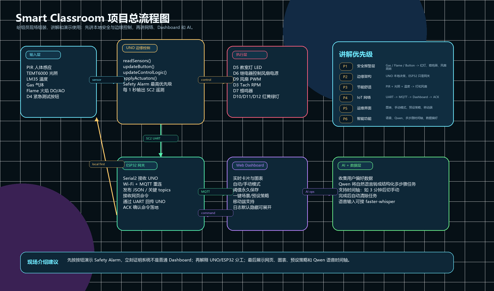
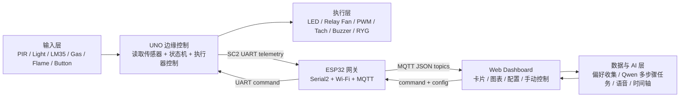

# Smart Classroom 项目总流程图（给组员）

## 一句话版本

这是一个“本地优先”的智慧教室系统：Arduino UNO 负责实时安全与节能控制，ESP32 负责 Wi-Fi / MQTT 网关，电脑网页负责可视化、手动控制、预设策略、数据分析和 AI/语音指令。

## 总流程

## 功能清单

| 层级 | 功能 | 现场怎么证明 |
| --- | --- | --- |
| 输入层 | PIR、光照、LM35、气体、火焰、按钮 | 网页/串口看到实时数值变化 |
| UNO 边缘控制 | 状态机、优先级、继电器、PWM、蜂鸣器、红黄绿灯 | 不依赖网页也能自动响应 |
| Safety Alarm | Gas / Flame / Button 触发最高优先级 | 按 D4 按钮，红灯亮、蜂鸣器间歇响、风扇高转 |
| 节能舒适 | 有人且暗则开灯；亮度足够则不开；温度高则风扇 | 用手遮光/走动/升温观察变化 |
| ESP32 网关 | UNO UART -> MQTT；Dashboard command -> UNO ACK | MQTT Explorer 或网页 ACK 状态 |
| Web Dashboard | 实时卡片、图表、手动模式、阈值、预设策略、移动端 | 浏览器打开后演示配置立刻生效 |
| AI / 语音 / 时间轴 | Qwen 把自然语言转成多步骤任务；支持延迟执行 | 例如“3分钟后切换手动模式”，时间轴完成后自动清除 |
| 数据分析 | 收集用户偏好和运行数据，生成趋势图/KPI | 展示温度、风扇、模式分布图 |

## 介绍优先级

1. **P1 安全报警层**：先按按钮演示 Safety Alarm。这个最直观，也最能证明项目不是简单传感器读数。
2. **P2 边缘架构**：说明 UNO 是本地控制节点，ESP32 是网关。强调网络断了，安全和基础控制仍然有效。
3. **P3 节能舒适逻辑**：讲 PIR + 光照 + 温度如何决定灯和风扇，体现“智能教室”的实际价值。
4. **P4 IoT 网络层**：讲 SC2 UART、MQTT topics、JSON telemetry、ACK command loop。
5. **P5 Web 运维界面**：展示移动端、图表、手动模式、阈值永久保存、预设策略。
6. **P6 AI 与数据层**：最后讲 Qwen、语音、时间轴、偏好收集。它是加分项，不要让它抢掉核心工程架构的主线。

## 每个组员现场记忆点

| 角色 | 负责讲什么 | 关键词 |
| --- | --- | --- |
| 硬件组员 | 接线、传感器、继电器、风扇供电、共地 | “12V 风扇电源独立，控制信号共地；温度传感器由 ESP32 供电避免漂移。” |
| UNO 组员 | 状态机、安全优先级、非阻塞 millis、Tach interrupt | “UNO 不等网络，先保证教室安全和舒适。” |
| ESP32 组员 | UART、Wi-Fi、MQTT、ACK、离线检测 | “ESP32 是网关，不直接控制传感器和继电器。” |
| Dashboard 组员 | 实时卡片、图表、手动/自动、预设策略、移动端 | “网页是运维入口，所有配置要能立刻生效并保存。” |
| AI/数据组员 | Qwen 多步骤任务、语音、时间轴、偏好数据 | “AI 不是聊天，它把人的自然语言转成可执行的结构化任务。” |

## 不建议的讲法

- 不要一开始就讲 AI，否则老师可能以为核心只是网页调用大模型。
- 不要把 ESP32 说成主控。主控是 UNO，ESP32 是 IoT Gateway。
- 不要只说“用了很多传感器”。重点是传感器经过优先级状态机后控制真实执行器。
- 不要把 Safety Alarm 讲成普通蜂鸣器测试。它是最高优先级的安全层。
